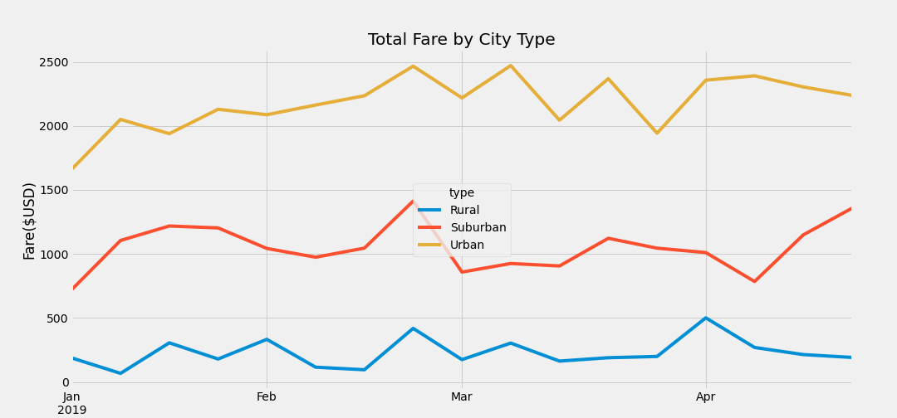

# PyBer_Analysis
## Overview of the analysis

PyBer is Python based ride sharing application. V. Isualize wants an analysis of the ride and city data. Using Python skills and knowledge of Pandas, a summary DataFrame of the ride-sharing data by city type was created. Then, using Pandas and Matplotlib, the total weekly fares for each city type was visualized in multiple-line graph. Differences between City types was analyzed for key trends in ride sharing usage and payment.

## Results

The total amount of rides and drivers is larger for urban than suburban and rural. The largest total fares is urban, followed by suburban then rural. The average fare per ride iss lower for urban than suburban and rural, and average fare per driver is lower for urban than suburban and rural.

### PyBer Summary by City Type

### Total Weekly Fares by City Type

## Summary
